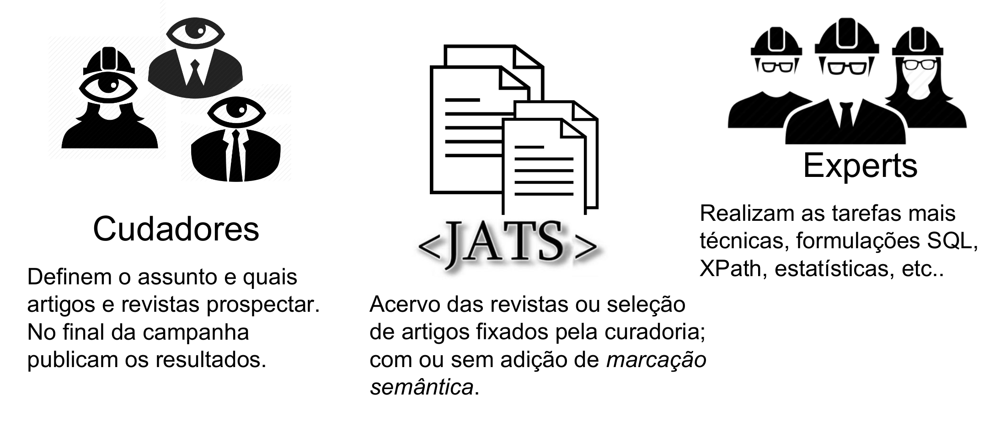

# observatorio-jats

O [_Journal Article Tag Suite_](https://en.wikipedia.org/wiki/Journal_Article_Tag_Suite) (**JATS**) é um formato XML usado para formatar e descrever a estrutura interna de conteúdos digitais da literatura científica. É o padrão técnico (formalmente NISO-ANSI Z39.96-2012) mais utilizado por [periódicos científicos](https://en.wikipedia.org/wiki/Scientific_journal). Não é apenas um padrão para  mostrar ou editar o conteúdo, como PDF, HTML, DOC, etc. É um padrão para dar significado às partes do conteúdo, e para indicar com todos os detalhes e de forma padronizada, os [metadados](https://en.wikipedia.org/wiki/Metadata) da publicação e da [proveniência](https://www.wikidata.org/wiki/Q30105403) de dados e da autoria.

São ~4 milhões de artigos JATS no [PubMed Central](https://www.ncbi.nlm.nih.gov/pmc/), ~0,5 milhões no [SciELO](http://www.scielo.org), mais alguns milhões dispersos em diversos outros repositórios JATS.

... É tanto JATS, e ninguém olha para eles como "mina de ouro" de conhecimento estruturado, ao menos no Brasil: a iniciativa do **Observatório JATS** nasceu para isso, para explorarmos mais essa imensa base de dados científicos, certificados, bem organizados, com estrutura e semântica bem definidas.

É um *observatório* de fato, pois há um "universo" que não damos conta de conhecer, dada a quantidade imensa de arquivos JATS e de detalhes contidos neles; mas podemos escolher um "alvo", e nos pormos a observar o que existe naquela região do "espaço JATS"... E para observar precisamos de ferramentas e pessoas operando essas ferramentas, constituindo assim um observatório.

Os alvos são assuntos ou perguntas viáveis do ponto de vista estatístico. Assim como num grande observatório astronômico, mantido por uma comunidade, o sucesso de suas observações depende do sucesso e alinhamento entre duas sub-comunidades: o grupo que formula as perguntas e dá significado às observações dentro de suas teorias, e o grupo que põe a mão na massa, sabe operar o equipamento, e realiza ou auxilia  nas *campanhas observacionais*.

Junte-se ao  Observatório JATS: juntando-se a uma *curadoria*, o grupo que faz perguntas dentro do seu escopo de interesse; ou juntando-se aos *experts* em buscas, estatísticas e JATS, que operam o observatório.

## Mantenedores

A **comunidade mantenedora deste projeto** é formada por dois grupos, a exemplo dos [grupos QueriDO](https://okfn-brasil.github.io/queriDO/site/curadorias/):

* **curadorias**: definem os "alvos", estabelecem para quais assuntos e artigos (documentos JATS) desejam voltar seus olhares, fazer suas explorações, e mais tarde entregar seus relatórios e pareceres. PS: não há restrição à participação em mais de uma curadoria.

* **experts**: entusiastas da Ciência Aberta, Estatística, programação, web semântica ou [*data scraping*](https://en.wikipedia.org/wiki/Data_scraping), ajudando  a *curadoria* a achar a "agulha no palheiro", e preparar milhares de *artigos JATS*  para constituir um [*corpus* textual](https://en.wikipedia.org/wiki/Corpus_linguistics) de análise: bem estruturado e suficientemente completo para cada *alvo* definido pelas *curadoriais*.   PS: um _expert_ pode também ser membro de uma _curadoria_.

## Campanhas observacionais

Olhar para uma imensa massa de artigos científicos, todos dispostos em JATS, requer alguns cuidados e metodologia. Nosso principal referencial metodológico são as [revisões sistemáticas](https://en.wikipedia.org/wiki/Systematic_review), a análise estatística, e as técnicas e tecnologias de bancos de dados (incluindo desde o [SQL](https://en.wikipedia.org/wiki/SQL) à [Web Semântica](https://en.wikipedia.org/wiki/Semantic_Web)).

Há naturalmente um funil de busca com criteriosa seleção, que envolve o trabalho e discussão entre todos, da *curadoria* e do grupo de *experts*. A exigência que prevalece é que sejam sempre realizadas ações de forma não tendenciosa.

### Etapas

1. Formação e homologação da curadoria (aprovação de alvo e dos compromissos da equipe);
2. Planejamento da campanha observacional, e alinhamentos com a equipe de experts (aprovação de calendários e responsabilidades);
3. Experimentos-piloto e provas de conceito;
4. Realização da campanha;
5. Revisão final;
6. Publicação de relatórios.

### Relatórios

Os resultados das campanhas observacionais ficam registrados em relatórios... Por hora não temos nenhum para mostrar, aguarde!

## Organizações que apoiam este projeto

* **FioCruz / CIDACS**: Centro de Integração de Dados de Conhecimentos para Saúde  http://www.cidacs.bahia.fiocruz.br/   Ver também [observatorio.fiocruz.br](http://observatorio.fiocruz.br/sobre) e [filminho de apresentação](https://www.facebook.com/fiocruzbahia.cidacs/posts/1634297083539026).

* **OKBr**: Open Knowledge do Brasil, através do [@ppkrauss](http://github.com/ppkrauss) http://ok.org.br  https://discuss.ok.org.br/5844

* **UnB**: através dos professores [Jorge H. C. Fernandes](http://www.cic.unb.br/~jhcf/) e [Ricardo B. Sampaio](http://brasilia.academia.edu/RicardoBarrosSampaio). http://www.unb.br
