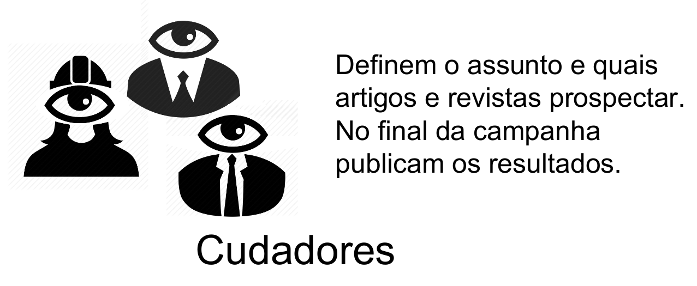

# Tutorial para o curador
&nbsp; 

Na equipe das campanhas são necessários dois atores, o *curador* e o *expert*. Este tutorial tem como público-alvo **os curadores**. É um complemento do [tutorial do expert](tutorial-expert.md) pois estaremos abordando os mesmos exemplos.

O objetivo do tutorial é **mostrar passo-a-passo dos levantamentos e os critérios para a interpretação de conjuntos de artigos JATS**. Como pano de fundo vamos supor a [campanha 05 sobre o Zika virus](https://github.com/UnB-CIDACS/observatorio-jats/tree/master/campanhas/c05-openCoherence-zika).

## Passo 1 - Levantamento do universo de artigos
A pesquisa dos artigos científicos pode fazer uso das mais diversas ferramentas (PubMed, Google Scholar, etc.) visãndo num primeiro momento máxima [_revocação_](https://en.wikipedia.org/wiki/Precision_and_recall). Aos poucos as filtragens de _precisão_  vão fixando o conjunto-universo dos artigos existentes sobre o tema da campanha. Outros elementos metodológicos também podem ser encontrados na  [literatura sobre *revisão sistemática*](https://blog.fastformat.co/revisao-sistematica-da-literatura-o-que-e-como-fazer/).

O principal produto do levantamento é uma lista de identificadores, que, na prática podem ser [DOI](https://en.wikipedia.org/wiki/Digital_object_identifier)s ou indetificadores PubMed (`PMID`).

**Exemplo**: buscar no [PubMed](https://www.ncbi.nlm.nih.gov/pubmed/) todos os artigos com a palavra-chave "Zika" ou "ZIKV" (suficientes para caracterizar o assunto [Zika virus](ht*tps://en.wikipedia.org/wiki/Zika_virus)). A maior parte dos artigos foi produzida entre 2014 e 2017, com grande salto em 2016... Depois de fazer a busca desejada pode-se baixar os resultados em uma planilha CSV  através do Flink: ver [este tutorial para maiores detalhes](https://www.ncbi.nlm.nih.gov/Structure/flink/docs/flink_how_to_save_pubmed_results_as_csv_file.html).

Para a planilha do tutorial foi usada em outubro de 2017 a busca `(Zika[Title/Abstract]) OR ZIKV[Title/Abstract]`.

Baixar a planilha gerada pelo Flink, algo como `123456.csv`. Renomear para algo mais significativo, com a seguinte sequência de prefixos concatenados:
* `pubMed` pois a pesquisa foi feita no PubMed.
* `_resultMax` pois buscou-se máxima  revocação...
* `-Zika-2017-10` é o rótulo do tema e uma referência de data (ano e mês).  

Resultando em [`pubMed_resultMax-Zika-2017-10.csv`](../data/tutorial/pubMed_resultMax-Zika-2017-10.csv), que pode então ser entregue para a equipe de experts.

## Passo 1.1 - Garantindo a precisão do universo de artigos selecionados

Até aqui maximizou-se a revogação, trazendo entre os 3412 artigos alguns falsos-positivos como o artigo PMID 24605459, *"Mosquitoes of Zika Forest, Uganda: species composition and relative abundance"*, que é relativo à [Zika Forest](https://en.wikipedia.org/wiki/Zika_Forest) e sua fauna... Vamos supor que a curadoria tenham homologado este e outros artigos sobre pássaros da floresta como falsos-positivos.

Cabe agora à equipe de experts listar (para que se confirme) e eliminar esses falsos-positivos, garantindo maior precisão do conjunto-universo ddepois da filtragem. Para simplificar, vamos supor que a filtragem consiste em avaliar resumos e títulos com as palavras-chave "forest", "bird" ou "ornithology". O resultado [da filtragem](), com apenas 11 itens (11/3412 = 0,3%) está em [c05_res1_02-BySql.csv](../data/tutorial/c05_res1_02-BySql.csv), e mostra que todos podem ser mantidos no universo, por se realicionarem também .

## Passo 1.1 - Perfil de distribuição por anos e ISSNs

A tabela abaixo ilustra o gráfico já mostrado pelo PubMed na pesquisa, mostrando o salto em 2016,

year |  n   
-----|------
2012 |    5
2013 |    3
2014 |   27
2015 |   37
2016 | 1641
2017 | 1626

O perfil completo de ano-quantidade está [c05_res1_01-BySql.csv](../data/tutorial/c05_res1_01-BySql.csv).

## Passo 2 - Filtrando o que sobra em JATS
...

## Passo 3 - Análise preliminar e qualificação dos arquivos JATS

## Passo 4 - Levantamentos estatísticos gerais

## Passo 6 - Levantamentos estatísticos específicos
